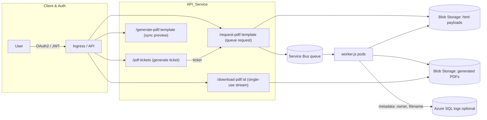

<p align="left">
  
</p>

 
# NAVA (node.js) PDF Service on Azure Kubernetes Service

NAVA is a scalable, Kubernetes-hosted service for on-demand PDF generation built with **Node.js**, **Python**, **Puppeteer**, **Azure Service Bus**, **Azure SQL**, and **Azure Blob Storage**, now enhanced with:


- **One-time generation tickets** (60 s TTL) to prevent replay/sharing of PDF requests
- **Deduplication window** (60 s) so identical requests reuse the same job
- **Secure, single-use streaming download** (no SAS links exposed)


---

## Table of Contents
1. [Architecture](#architecture)  
2. [Features](#features)  
3. [Endpoints](#endpoints)  
4. [Prerequisites](#prerequisites)  
5. [Environment Variables](#environment-variables)  
6. [Azure Resources & Roles & Workload Identity Assignments](#azure-resources--roles--workload-identity-assignments)  
7. [Database Setup](#database-setup)  
8. [CI / CD](#ci--cd)  
9. [Kubernetes Deployment](#kubernetes-deployment)  
10. [Repository Structure](#repository-structure)  
11. [Testing](#testing)  
12. [Linting & Formatting](#linting--formatting)  
13. [License](#license)

---

## Architecture


---

## Detailed Workflow

1. **User Authentication**  
   Client authenticates with OAuth2/JWT via Auth0 or Azure AD.

2. **Obtain Generation Ticket**  
   - `POST /pdf-tickets` with bearer token.  
   - Returns a one-time JWT ticket valid for 60s.

3. **Submit PDF Request**  
   - `POST /request-pdf/:template` with bearer token, `X-PDF-Ticket`, and template parameters.  
   - Deduplicates identical requests (60s window).  
   - Stores gzipped HTML in Blob and enqueues a Service Bus message.

4. **Worker Processing**  
   - Worker pod downloads, decompresses HTML, renders PDF via Puppeteer, uploads PDF with metadata.

5. **Poll Job Status**  
   - `GET /pdf-jobs/:id` returns `PENDING` or `READY`.

6. **Download PDF (Single-Use)**  
   - `GET /download-pdf/:id` streams the PDF once and marks it collected.

7. **Subsequent Access**  
   - Further download attempts return **410 Gone**.

---


## Features

- 🔑 **One-time generation ticket**: clients must obtain a signed JWT valid for 60 s via `POST /pdf-tickets` before requesting a PDF.
- 🔄 **Deduplication**: identical template+parameters requests within 60 s share the same job, conserving resources.
- 📥 **Async PDF queue**: `POST /request-pdf/:template` uploads gzipped HTML payload (claim-check) and enqueues on Azure Service Bus.
- ⚡ **Sync PDF preview**: `GET /generate-pdf/:template` renders HTML to PDF on demand (legacy endpoint unchanged).
- 🚿 **Secure, single-use download**: `GET /download-pdf/:id` streams the PDF once; further attempts return **410 Gone**.
- 🛡️ **Auth0 & Azure AD** for API protection; **Workload Identity** for storage & bus access.

---

## Endpoints

### 1. Obtain a generation ticket
```http
POST /pdf-tickets
Authorization: Bearer <JWT>
```
**Response:**
```json
{ "ticket": "<JWT>", "ttl": 60 }
```

### 2. Request a queued PDF
```http
POST /request-pdf/:template
Authorization: Bearer <JWT>
X-PDF-Ticket: <ticket>
Content-Type: application/json

{ "param1": "value1","etc."}
```
- Deduplicates identical calls within 60 s.
- **202 Accepted**: `{ "status": "queued", "jobId": "<id>" }`

### 3. Check job status
```http
GET /pdf-jobs/:id
Authorization: Bearer <JWT>
```
```json
{ "status": "PENDING", "READY"}
```

### 4. Download generated PDF (single-use)
```http
GET /download-pdf/:id
Authorization: Bearer <JWT>
```
- Streams with `Content-Disposition: attachment`.
- Further calls return **410 Gone**.

---

## Prerequisites

- **Azure services:** AKS, ACR, Azure SQL (optional for logs), Service Bus (Standard), Blob Storage.  
- **Local tools:** Node ≥ 18, Python ≥ 3.12, Docker, Azure CLI, kubectl.

---

## Environment Variables

| Name                         | Required | Description                                                                                      |
|------------------------------|:--------:|--------------------------------------------------------------------------------------------------|
| `PORT`                       |          | Express port (default `3000`)                                                                    |
| `AZURE_TENANT_ID`            | ✔        | Azure AD tenant ID                                                                               |
| `AZURE_AD_AUDIENCE`          | ✔        | Application ID URI for Azure AD tokens                                                          |
| `AUTH0_DOMAIN`               | ✔        | Auth0 tenant domain (e.g. `xyz.auth0.com`)                                                       |
| `AUTH0_API_AUDIENCE`         | ✔        | API identifier for Auth0 tokens                                                                  |
| `SQL_SERVER`, `SQL_DB`       | ✔        | Azure SQL for audit logs (optional)                                                              |
| `SCRIPTS_DIR`                |          | Mount path for template assets (default `/opt/app/scripts`)                                      |
| `PUPPETEER_EXECUTABLE_PATH`  |          | Chromium binary path (in container)                                                              |
| `SB_NAMESPACE`, `SB_QUEUE`   | ✔        | Service Bus namespace & queue name                                                               |
| `PAYLOAD_CONTAINER`          |          | HTML payload container (default `pdfpayloads`)                                                   |
| `PDF_CONTAINER`              |          | PDF output container (default `generated-pdfs`)                                                  |
| `STORAGE_URL`                | ✔        | Blob endpoint (e.g. `https://<acct>.blob.core.windows.net`)                                      |
| `TICKET_SECRET`              | ✔        | Random ≥ 32 byte secret for signing generation tickets                                           |

---

## Azure Resources & Roles & Workload Identity Assignments

| Resource                   | Role to assign                                                             |
|----------------------------|-----------------------------------------------------------------------------|
| **Service Bus namespace**  | Azure Service Bus Data Sender<br>Azure Service Bus Data Receiver            |
| **Storage account (Blob)** | Storage Blob Data Contributor (upload)<br>Storage Blob Data Reader (download)|
| **Azure SQL DB** (optional)| `db_datawriter` on your logging database                                     |

**Example Azure CLI commands**:
```bash
# Service Bus
az role assignment create   --assignee-object-id <MI_PRINCIPAL_ID>   --role "Azure Service Bus Data Sender"   --scope <SERVICE_BUS_NAMESPACE_RESOURCE_ID>
az role assignment create   --assignee-object-id <MI_PRINCIPAL_ID>   --role "Azure Service Bus Data Receiver"   --scope <SERVICE_BUS_NAMESPACE_RESOURCE_ID>

# Blob Storage
az role assignment create   --assignee-object-id <MI_PRINCIPAL_ID>   --role "Storage Blob Data Contributor"   --scope <STORAGE_ACCOUNT_RESOURCE_ID>
az role assignment create   --assignee-object-id <MI_PRINCIPAL_ID>   --role "Storage Blob Data Reader"   --scope <STORAGE_ACCOUNT_RESOURCE_ID>

# Azure SQL (optional)
az role assignment create   --assignee-object-id <MI_PRINCIPAL_ID>   --role "db_datawriter"   --scope <SQL_DATABASE_RESOURCE_ID>
```

---

## Database Setup (optional)
```sql
CREATE TABLE dbo.Logs (
  LogId      BIGINT IDENTITY(1,1) PRIMARY KEY,
  CreatedUtc DATETIME2 NOT NULL DEFAULT SYSUTCDATETIME(),
  Level      VARCHAR(16) NOT NULL,
  Message    NVARCHAR(MAX) NOT NULL,
  MetaJson   NVARCHAR(MAX)
);
```

---

## CI / CD

- **Azure Pipelines**: builds multi-arch Docker image, pushes to ACR, applies k8s manifests.  
- **GitOps**: configured via `k8s/kustomization.yaml`.

---

## Kubernetes Deployment

1. **Create ticket secret**:
```bash
kubectl create secret generic ticket-secret   --from-literal=TICKET_SECRET="$(openssl rand -base64 48)"
```
2. **Apply manifests**:
```bash
kubectl apply -k k8s/
kubectl rollout restart deploy/navav2 deploy/navav2-worker
```

---

## Repository Structure

```text
├── Dockerfile
├── README.md
├── requirements.txt
├── templates/        # HTML, JS, Python templates
├── service/
│   ├── index.js      # API + producer
│   ├── worker.js     # Consumer
│   ├── pdf.js        # PDF helper
│   └── package.json
└── k8s/
    ├── deployment.yaml
    ├── worker-deployment.yaml
    ├── service.yaml
    ├── ingress.yaml
    ├── service-account.yaml
    ├── gitsync-patch.yaml
    └── kustomization.yaml
```

---

## Testing

- **Jest** (Node): `npm test --prefix service`  
- **Pytest** (Python): `pytest templates/`

---

## Linting & Formatting

- **ESLint + Prettier** for JavaScript  
- **Flake8 + Black** for Python

---

## License

Apache 2.0 – see [LICENSE](LICENSE) for details.


